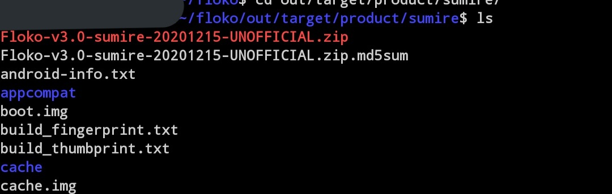

必要なPC（VPSでも可）

* CPU: 4コア（速くビルドしたければ8コア）
* RAM: 32GB（スワップを作ればそれ以下でもできるが遅くなる）
* ストレージ: 空き容量200GB以上のSSD
* OS: Ubuntu18.04LTS（それ以外では未確認）

今回はGoogleComputeEngine e2-standard8を使用しました（CPUx8 RAM 32GB）

## 1. ビルドに必要な物をインストール

`sudo apt update && sudo apt install bc bison build-essential ccache curl flex g++-multilib gcc-multilib git gnupg gperf imagemagick lib32ncurses5-dev lib32readline-dev lib32z1-dev liblz4-tool libncurses5-dev libsdl1.2-dev libssl-dev libwxgtk3.0-dev libxml2 libxml2-utils lzop pngcrush rsync schedtool squashfs-tools xsltproc zip zlib1g-dev python openjdk-11-jdk`

※Ubuntu20.04の場合は`libwxgtk3.0-dev`を`libwxgtk3.0-gtk3-dev`にし、`libncurses5`を追加

repoコマンドのインストール

```bash
mkdir -p ~/bin
curl https://storage.googleapis.com/git-repo-downloads/repo > ~/bin/repo
chmod a+x ~/bin/repo
```

.profileを編集して$HOME/binをPACHに追加  
`nano ~/.profile`

以下の記述を追加（同じ記述があれば不要）

```bash
if [ -d "$HOME/bin" ] ; then
    PATH="$HOME/bin:$PATH"
fi
```

環境の更新  
`source ~/.profile`

## 2. 作業用ディレクトリの作成

```bash
mkdir lineage
cd lineage
```

Gitの設定（ビルドのみならandroidでも問題ないが今後Gitを使う予定のある人はユーザー名とメールアドレスを正しく入力したほうが良い）

```bash
git config --global user.name "android"
git config --global user.email "android"
```

リポジトリの初期化  
`repo init -u https://github.com/LineageOS/android.git -b lineage-17.1`

ソースコードの取得（環境によっては非常に時間がかかります）  
`repo sync --force-sync`

## 3. 端末固有のソースコードを取得

local_manifestsに書き込むことでrepo sync時に同期されます  
XperiaZ5,Z5c向けに作ったものがあるので今回はこれを利用する↓  
[https://github.com/minetaro12/kitakami_local_manifests](https://github.com/minetaro12/kitakami_local_manifests)

※他の端末向けの書き方はわかりやすく書いているサイトがあるので、[こちら](https://dev.maud.io/entry/2019/07/18/howto-build-lineageos-16-0/index.html)を参照

manifestを置くディレクトリを作成  
`mkdir -p .repo/local_manifests`

local_manifestsディレクトリ内にmanifestを置く  
例:`~/lineage/.repo/local_manifests/sumire.xml`

再度ソースコードを取得  
`repo sync --force-sync`

## 4. ビルド

以下のコマンドを実行してビルドの準備（？）をする  
`. build/envsetup.sh`

以下のコマンドでビルドが始まります  
`brunch sumire 2>&1 | tee lineage_$(date '+%Y%m%d_%H-%M-%S').log`

Z5cの場合はsumireをsuzuranにする  
他の端末の場合はsumireをその端末のコードネームにする

無事に終了するとbuild completed successfullyが表示されます

<blockquote class="twitter-tweet"><p lang="ja" dir="ltr">XperiaZ5向けのFlokoROMビルドできた！<br>早速実機テストしてみる <a href="https://t.co/sym34UHG6h">pic.twitter.com/sym34UHG6h</a></p>— Oさん (@1osan_x) <a href="https://twitter.com/1osan_x/status/1337364301162532864?ref_src=twsrc%5Etfw">December 11, 2020</a></blockquote> <script async src="https://platform.twitter.com/widgets.js" charset="utf-8"></script>

自分の環境だと3時間半くらいかかりました

\~/lineage/out/target/product/コードネーム内にzipファイルができているので取り出してTWRPでインストールします


