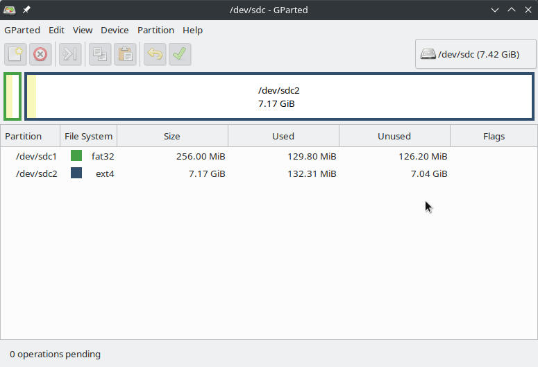
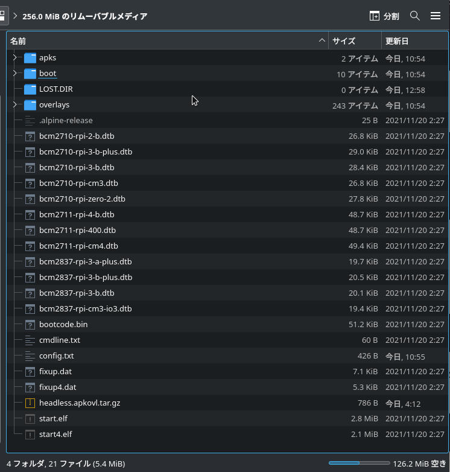

RaspberryPiにAlpineLinuxをヘッドレスインストールしてみます。

ディスクレスモードというのがあり、基本的にRAM上で動作しSDカードへの書き込みを抑えるようになってます。

***

## 環境

ターゲット RaspberryPi 3B+

microSDカード 8GB

作業PC Ubuntu20.04

***

## 1. SDカードの準備

Gpartedでも何でも良いので画像のような感じでSDカードのパーティションを区切ります。



先頭に256MBのパーティションを作成しFAT32でフォーマット、残りはすべてext4のパーティションにします。

ext4の方は、ユーザーのホームディレクトリの永続化に使います。

## 2. ファイルのダウンロード＆解凍

[ここ](https://alpinelinux.org/downloads/)からRaspberryPi用のイメージをダウンロードします。

今回はaarch64を使いました。

[ここ](https://github.com/davidmytton/alpine-linux-headless-raspberrypi/releases/download/2021.06.23/headless.apkovl.tar.gz)からヘッドレスインストールに必要なファイルをダウンロードします。

OSイメージは解凍し、中身を先ほど作成したFAT32のパーティションにコピーします。

ヘッドレスインストールに必要なファイルは解凍せずに、そのままFAT32のパーティションにコピーします。

1個目のパーティションのファイルは画像のようになります。



WiFiを使用したい場合はFAT32のパーティション直下に`wifi.txt`を作成し、`ssid password`のような形式で書き込んでください。

## 3. 起動

RaspberryPiにSDカードとLANケーブルを差し込み、電源を入れます。

しばらくしたらDHCPサーバー（ルーター）でIPアドレスを確認します。

もしくは作業PCからnmapを使って確認します。

```
$ sudo nmap -sP 192.168.8.0/24
Starting Nmap 7.80 ( https://nmap.org ) at 2021-11-27 15:14 JST
:
Nmap scan report for 192.168.8.50
Host is up (0.0074s latency).
MAC Address: XX:XX:XX:XX:XX:XX (Raspberry Pi Foundation)
:
Nmap done: 256 IP addresses (3 hosts up) scanned in 2.31 seconds
```

## 4. セットアップ

IPアドレスがわかったらSSHでログインします。

初期設定ではrootアカウントのみでパスワード無しです。

```
$ ssh root@192.168.8.50
Welcome to Alpine!

The Alpine Wiki contains a large amount of how-to guides and general
information about administrating Alpine systems.
See <http://wiki.alpinelinux.org/>.

You can setup the system with the command: setup-alpine

You may change this message by editing /etc/motd.

localhost:~#
```

ここで`setup-alpine`を実行し画面の指示に従ってセットアップします。

最後の方で設定の保存先を聞かれますが、そのままエンターでOKです。

```
No disks available. Try boot media /media/mmcblk0p1? (y/n) [n] #エンター
Enter where to store configs ('floppy', 'mmcblk0p1', 'usb' or 'none') [mmcblk0p1] #エンター
Enter apk cache directory (or '?' or 'none') [/media/mmcblk0p1/cache] ? #エンター
```

## 5. SSHの設定

このまま再起動するとSSHにrootログインできなくなるので、次のコマンドで設定を追加します。

```bash
echo "PermitRootLogin yes" >> /etc/ssh/sshd_config
```

これでrootログインできるようになりました。

## 6. 変更の保存＆再起動

ヘッドレスインストールに使ったファイルを削除します。

```bash
mount -o remount,rw /media/mmcblk0p1
rm /media/mmcblk0p1/*.apkovl.tar.gz
rm /media/mmcblk0p1/wifi.txt
rc-update del local default
rm /etc/local.d/headless.start
```

冒頭で述べたように基本的にRAM上で動作するので、再起動するともとに戻ってしまいます。

そこで`lbu commit -d`を実行してから再起動します。

```bash
lbu commit -d
reboot
```

## 7. 永続化用パーティションをマウント

先程設定したrootパスワードでログインします。

```
$ ssh root@192.168.8.50 
root@192.168.8.50's password: 
Welcome to Alpine!

The Alpine Wiki contains a large amount of how-to guides and general
information about administrating Alpine systems.
See <http://wiki.alpinelinux.org/>.

You can setup the system with the command: setup-alpine

You may change this message by editing /etc/motd.

alpine:~#
```

`blkid`を実行しパーティションがあることを確認します。

```
alpine:~# blkid 
/dev/loop/0: TYPE="squashfs"
/dev/mmcblk0p2: UUID="xxxxxxxx-xxxx-xxxx-xxxx-xxxxxxxxxxxx" TYPE="ext4"
/dev/mmcblk0p1: UUID="XXXX-XXXX" TYPE="vfat"
/dev/loop0: TYPE="squashfs"
```

二個目のパーティション(mmcblk0p2)のマウントポイントを作成します。

```bash
mkdir /media/mmcblk0p2
```

/etc/fstabに追記し、起動時にマウントされるようにします。

```bash
echo "/dev/mmcblk0p2 /media/mmcblk0p2 ext4 rw,relatime 0 0" >> /etc/fstab
```

`mount -a`を実行すると`/media/mmcblk0p2`にマウントされます。

```
alpine:~# mount -a
alpine:~# df
Filesystem           1K-blocks      Used Available Use% Mounted on
devtmpfs                 10240         0     10240   0% /dev
shm                     466668         0    466668   0% /dev/shm
/dev/mmcblk0p1          258095    128880    129215  50% /media/mmcblk0p1
tmpfs                   466668     15936    450732   3% /
tmpfs                   186668       116    186552   0% /run
/dev/loop0               25472     25472         0 100% /.modloop
/dev/mmcblk0p2         7335536     16512   6926680   0% /media/mmcblk0p2
```

## 8. ユーザーの作成

ホームディレクトリを作成します。

```bash
mkdir -p /media/mmcblk0p2/home/user
```

ユーザーを作成し`wheel`グループに所属させます。

```bash
adduser -h /media/mmcblk0p2/home/user user
adduser user wheel
```

sudoをインストールします。（エディターもついでに）

```bash
apk add sudo nano
```

`wheel`グループのユーザーがsudoコマンドを実行できるようにします。

`# %wheel ALL=(ALL) ALL`のコメントを外してください。

```bash
EDITOR=nano visudo
```

SSHのrootログインを無効にします。
`PermitRootLogin yes`を`no`に変更します。

```bash
nano /etc/ssh/sshd_config
```

変更を保存し再起動します。

```bash
lbu commit -d
reboot
```

再起動後、作成したユーザーでログインできることを確認します。

```
$ ssh user@192.168.8.50
user@192.168.8.50's password: 
Welcome to Alpine!

The Alpine Wiki contains a large amount of how-to guides and general
information about administrating Alpine systems.
See <http://wiki.alpinelinux.org/>.

You can setup the system with the command: setup-alpine

You may change this message by editing /etc/motd.

alpine:~$
```

これで基本的なインストールは完了です。
