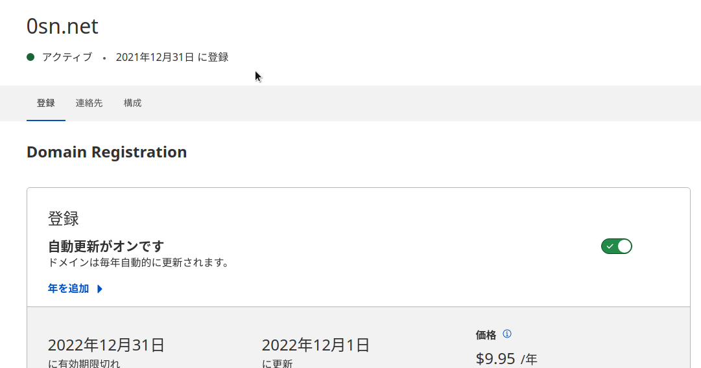

+++
title = "0sn.netを取得したので移行しました"
date = "2022-01-04T12:35:47+09:00"
author = "minetaro12"
authorTwitter = "" #do not include @
cover = ""
tags = ["domain", "web"]
keywords = ["", ""]
description = " "
showFullContent = false
readingTime = false
comments = true
toc = false
archives = ["2022", "2022-01"]
+++
あけましておめでとうございます（今更

短いドメインが欲しいなと思い、`0sn.net`を取得しました。

意味的にはOさん→osan→0san→0snといったところです。

`minetaro12.com`はお名前.comで取得し、CloudflareRegistrarに移管しましたが、今回は最初からCloudflareRegistrarで取得しました。

TLDは.xyzでも良かったのですが、スパムサイトに使われたりと怪しい感じなので.netにしました。

値段は$9.95でした。更新も同じです。結構安い。



移行は簡単でhugoの`config.toml`のbaseurlを新しいドメインに書き換えて、Vercelのドメイン設定を変更するだけです。

ただ旧ドメインでアクセスできなくなっても困るので、`minetaro12.com`は現ドメインにリダイレクトするようにしまたした。

ドメイン以降のパスを保持するようにしてあるので、[minetaro12.com/posts/new_domain/](https://minetaro12.com/posts/new_domain/)にアクセスすると、このページに飛びます。

Nginxで設定したのはこんな感じです。

```conf
server {
        :
        server_name minetaro12.com;
        return 301 https://0sn.net$request_uri;
        :
}
```

`minetaro12.com`はMisskeyインスタンス等いろいろ使ってるので、今後も維持していくつもりです。

これからは`0sn.net`と`minetaro12.com`の2つのドメインを使っていく感じになりそうです。
