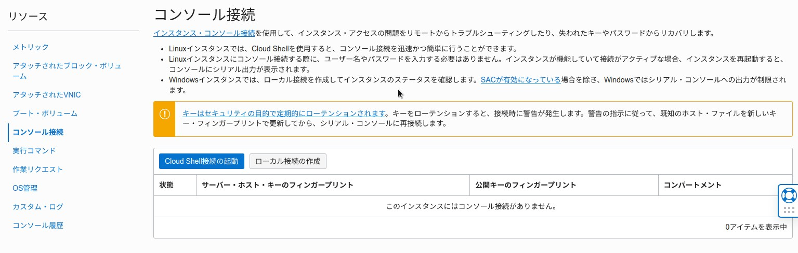
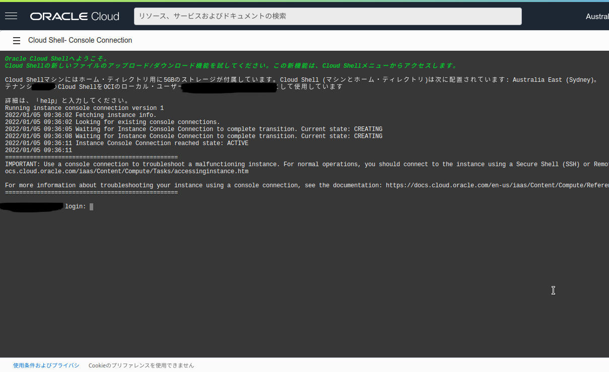
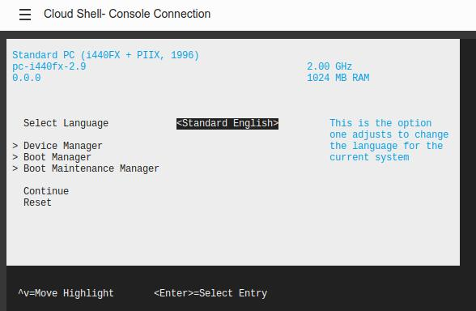
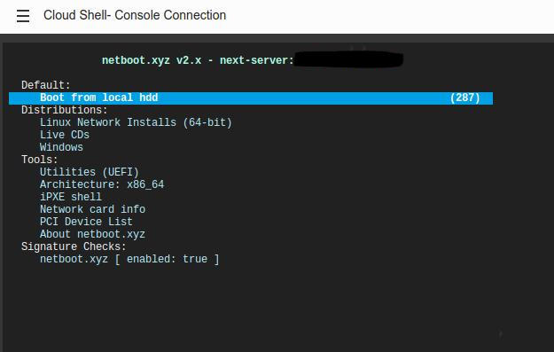

OCIにはOSの再インストール機能等がないので、再インストールしたい場合はインスタンスごと作り直す必要があります。

netboot.xyzを使うと再作成しなくてもOSを再インストールできるようなので試しました。

***

## 環境

OracleCloudのARM64で確認しました。  
再インストールOSはdebianのみ確認しました。

## 1. SSHでログイン

まずSSHでインスタンスにログインします。

```
$ ssh ubuntu@xxx.xxx.xxx.xxx -i ssh-key-xxxx-xx-xx.key
```

## 2. netboot.xyzのダウンロード

```bash
wget https://boot.netboot.xyz/ipxe/netboot.xyz-arm64.efi
```

/boot/efiにコピーします

```bash
sudo cp <.efi file> /boot/efi
```

こうなればOKです

```
$ sudo ls /boot/efi
EFI  netboot.xyz.efi
```

SSH接続はまだ切らないでください。

## 3. コンソール接続を使ってブートメニューに入る

インスタンスのダッシュボードからコンソール接続をクリックし、Cloud Shell接続の起動をクリックします。



クリックすると次のような画面になるので、一度エンターを押します。



ここでSSHから`sudo reboot`します。  
するとコンソール画面に起動ログが流れるので、ESCを連打します。



上下キーとエンターで、Boot Maintenance Manager→Boot From File→UEFI~→netboot.xyz.efiに進みます。

netboot.xyz.efiを選択すると次のような画面になります。



## 4. OSをインストールする

### <span style="color: red; ">※OSの再インストールを行うとディスク上のすべてのデータが削除されます。</span>

Linux Network Installs→Debian→インストールしたいバージョンを選択→Text Based Installに進みます。  
しばらくするとDebianのテキストベースインストーラが起動するので、画面に従ってインストールします。

AMD64インスタンスでは何故かインストーラが起動しませんでした。