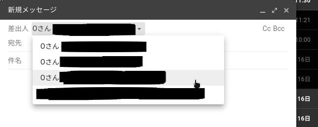

+++
title = "無料で独自ドメインメールアドレスを作ってみる"
date = "2022-01-17T11:27:16+09:00"
author = "minetaro12"
authorTwitter = "" #do not include @
cover = ""
tags = ["domain", "mail"]
keywords = ["", ""]
description = " "
showFullContent = false
readingTime = false
comments = true
toc = true
archives = ["2022", "2022-01"]
+++
自分でメールサーバーを建てずに、独自ドメインでメールを送受信してみます。

無料プランを使用しているので制限があります。(ImprovMXでの受信は一日500通まで、SendGridでの送信は一日100通まで)

---

## 必要なもの
* 独自ドメイン(freenom等の無料ドメインでもできますが非推奨)
* [ImprovMX](https://improvmx.com/)のアカウント(CloudflareのメールルーティングでもOK)
* [SendGrid](https://sendgrid.com/)のアカウント(GmailのSMTPサーバーを使う場合は不要)
* Gmailアカウント

---

## 1. 受信をできるようにする

ここではImprovMXを使います。(Cloudflareのメールルーティングが使える場合はそちらでもOKです)

[こちら](https://improvmx.com/)でアカウントを作成します。

ログインできたら、`Add new domain`で独自ドメインを追加し画面の指示に従ってDNSレコードの追加をします。

DNSレコードの追加はネームサーバーによって異なるので省きます。

追加できたらエイリアスの追加をします。

FOWARDS TOの前には受信したいアドレスを入力します。(例:example@example.com)

FOWARDS TOの後には転送先のGmailアドレスを入力します。

ここで複数登録することもできます。

試しにエイリアス登録したアドレスにメールを送信し、転送先で受信できればOKです。

## Cloudflareのメールルーティングを使った場合のやり方

2022/01/20追記

※<u>DNSでCloudflareを使う必要があります。</u>

まず使いたいドメインのダッシュボードに移動し、メールアドレスに移動します。

まだ使えるようになっていない場合は下のような画面になるので、`アクセスを要求します`をクリックします。(使えるようになるまで時間がかかります。)

使えるようになっていると下のような画面になるので、`レコードを自動的に追加する`をクリックします。

レコードが追加されたら`アドレスを作成`をクリックし、左側に受信したいアドレス、右側に転送先のGmailアドレスを入力します。(初めて追加した転送先の場合は転送先に確認メールが送信されます。)

同じ手順で複数のメールアドレスを追加することができます。

試しに登録した独自ドメインメールアドレス宛にメールを送信し、転送先に届けばOKです。

## 2. 送信できるようにする

ここではSendGridを使います。

[こちら](https://signup.sendgrid.com/)でアカウントを作成します。

ログインできたら、`Settings`→`Sender Authentication`→`Domain Authentication`で先程の受信できるようにしたドメインを登録します。

ここでもDNSレコードの追加があるので画面の指示に従って行います。

ドメインの登録が完了したら`Settings`→`API Keys`→`Create API Key`で、適当な名前をつけて`FullAccess`を選択し、`Create & View`をクリック。

ここでAPIキーが表示されるので<u>必ずメモ</u>します。(※後から表示はできません)

次にGmailにログインします。

右上の歯車マークを押し、`すべての設定を表示`をクリック。

`アカウントとインポート`タブに移動し、`他のメールアドレスを追加`をクリック。

`追加するメールアドレスを入力してください。`と表示されるので、先程設定したアドレスを入力します。

名前の部分は送信相手に表示されます。

`エイリアスとして扱います。`のチェックは外します。

次に、SMTPサーバーの設定をします。

SMTPサーバーは`smtp.sendgrid.net`

ユーザー名は`apikey`

パスワードは先程メモしたAPIキーを入力します。

他の部分はそのままでOKです。

アカウント追加をクリックすると、下のような確認メールが届きます。

確認メールのリンクをクリックするとアドレスの追加が完了します。

追加できていれば、メール作成画面の差出人に追加されています。

## GmailのSMTPサーバーを使う場合

2022/01/26追記

[こちら](https://improvmx.com/guides/send-emails-using-gmail/)の方法を使います。

まず、[こちら](https://www.google.com/landing/2step/)からGoogleアカウントの二段階認証を設定します。

次に、[こちら](https://security.google.com/settings/security/apppasswords)からアプリパスワードを設定します。(アプリを選択ではメール、デバイスを選択で使っている端末を設定します。)

<u>ここで表示されたパスワードは必ずメモします。</u>

次にGmailにログインします。

ここから先は[先程の手順](#2-%E9%80%81%E4%BF%A1%E3%81%A7%E3%81%8D%E3%82%8B%E3%82%88%E3%81%86%E3%81%AB%E3%81%99%E3%82%8B)とほぼ同じで、メールアドレスを追加する画面まで行きます。

ここでも`エイリアスとして扱います。`のチェックは外します。

SMTPサーバーの設定では`smtp.gmail.com`

ユーザー名はGoogleアカウントのログインに使ってるGmailアドレス

パスワードは先程設定したアプリパスワードを設定します。

アカウントの追加をクリックした後は同じです。

## 3. 独自ドメイン宛のメールをラベル分けする

このままでは、Gmail宛のメールと独自ドメイン宛のメールは一緒になってしまうのでラベル分けします。

Gmailの右上の歯車マークを押し、`すべての設定を表示`をクリック。

`フィルタとブロック中のアドレス`タブに移動し、`新しいフィルタを作成`をクリックします。

Toにドメインを入力して、`フィルタを作成`をクリックします。

`ラベルをつける`にチェックを入れ、 右のプルダウンメニューから`新しいラベル...`をクリックしラベルを作成します。

下の画像では`example.com`というラベルを選択しています。

できたら`フィルタを作成`をクリックします。

左側にラベルが表示されるので、独自ドメイン宛のメールはそこに表示されるようになります。

