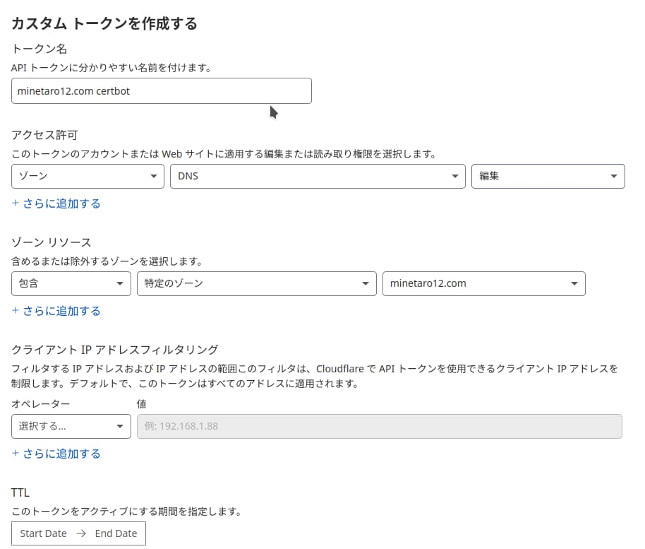

通常ワイルドカード証明書を発行する場合はDNS認証を手動で行う必要がありますが、CloudflareのDNSを使っている場合はAPIを利用して自動化することができます。

---

## 1. APIトークンの取得と設定

まずCloudflareのダッシュボードにログインしたら、右上のアイコンから`マイプロフィール`→`APIトークン`→`トークンを作成する`→カスタム トークンを作成するの`始める`に進みます。

下のように編集しトークンを作成します。



ここで発行したトークンを保存します。(パーミッションに注意してください。)

```bash
mkdir ~/.secrets
vim ~/.secrets/minetaro12-com.ini

dns_cloudflare_api_token=<発行したトークン>
```

## 2. Certbotの設定

Certbotとプラグインをインストールします。(ここではsnapを利用します。)

```bash
sudo snap install --classic certbot
sudo snap set certbot trust-plugin-with-root=ok #これをしないとプラグインが入らない
sudo snap install certbot-dns-cloudflare
```

## 3. 証明書を発行する

必ずトークンを保存した場所を指定します。

```bash
$ sudo certbot certonly \
    --dns-cloudflare \
    --dns-cloudflare-credentials /home/ubuntu/.secrets/minetaro12-com.ini \
    -d *.minetaro12.com \
    -m <email> \
    -n

Saving debug log to /var/log/letsencrypt/letsencrypt.log
Requesting a certificate for *.minetaro12.com
Waiting 10 seconds for DNS changes to propagate

Successfully received certificate.
Certificate is saved at: /etc/letsencrypt/live/minetaro12.com/fullchain.pem
Key is saved at:         /etc/letsencrypt/live/minetaro12.com/privkey.pem
This certificate expires on 2022-05-18.
These files will be updated when the certificate renews.
Certbot has set up a scheduled task to automatically renew this certificate in the background.

- - - - - - - - - - - - - - - - - - - - - - - - - - - - - - - - - - - - - - - -
If you like Certbot, please consider supporting our work by:
 * Donating to ISRG / Let's Encrypt:   https://letsencrypt.org/donate
 * Donating to EFF:                    https://eff.org/donate-le
- - - - - - - - - - - - - - - - - - - - - - - - - - - - - - - - - - - - - - - -
```