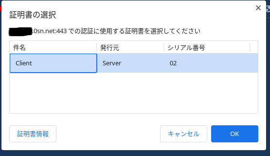

BASIC認証では不安なのでNginxでクライアント証明書を使った認証のやり方のメモ

NginxとOpenSSLが必要です。  
Cloudflareを使用している場合は動かないので注意してください。

作成するファイル
- ca.crt <-- Nginxの設定に使う
- ca.key
- ca.csr
- ca.srl
- client.crt
- client.csr
- client.key
- client.pfx <--クライアントにインストールするファイル

## 1. 作業ディレクトリの作成

適当なディレクトリを作成します。  
rootユーザーで作業します。

```bash
cd /etc/nginx
mkdir client_cert
cd client_cert
```

## 2. CA

###  2-1. CAの鍵を作成

```bash
openssl genrsa 4096 > ca.key
```

```
root@localhost:/etc/nginx/client_cert# openssl genrsa 4096 > ca.key
Generating RSA private key, 4096 bit long modulus (2 primes)
.....................................................................++++
....................................................................................++++
e is 65537 (0x010001)

root@localhost:/etc/nginx/client_cert# ls
ca.key
```

### 2-2. CSRの作成

```bash
openssl req -new -key ca.key > ca.csr
```

`Organization Name`は必ず設定します。  
`Common Name`は必ず空にします。  
それ以外は任意で入力してください。

```
root@localhost:/etc/nginx/client_cert# openssl req -new -key ca.key > ca.csr
You are about to be asked to enter information that will be incorporated
into your certificate request.
What you are about to enter is what is called a Distinguished Name or a DN.
There are quite a few fields but you can leave some blank
For some fields there will be a default value,
If you enter '.', the field will be left blank.
-----
Country Name (2 letter code) [AU]:JP
State or Province Name (full name) [Some-State]:
Locality Name (eg, city) []:
Organization Name (eg, company) [Internet Widgits Pty Ltd]:Server
Organizational Unit Name (eg, section) []:
Common Name (e.g. server FQDN or YOUR name) []:
Email Address []:

Please enter the following 'extra' attributes
to be sent with your certificate request
A challenge password []:
An optional company name []:

root@localhost:/etc/nginx/client_cert# ls
ca.csr  ca.key
```

### 2-3. CAの証明書を作成

```bash
openssl x509 -days 3650 -req -signkey ca.key < ca.csr > ca.crt
```

```
root@localhost:/etc/nginx/client_cert# openssl x509 -days 3650 -req -signkey ca.key < ca.csr > ca.crt
Signature ok
subject=C = JP, ST = Some-State, O = Server
Getting Private key

root@localhost:/etc/nginx/client_cert# ls
ca.crt  ca.csr  ca.key
```

### 2-4. シリアル番号の設定

```
echo 01 > ca.srl
```

## 3. クライアント

### 3-1. クライアントの鍵を作成

```bash
openssl genrsa 4096 > client.key
```

```
root@localhost:/etc/nginx/client_cert# openssl genrsa 4096 > client.key
Generating RSA private key, 4096 bit long modulus (2 primes)
...................................................................................................++++
........................................................................................................................++++
e is 65537 (0x010001)

root@localhost:/etc/nginx/client_cert# ls
ca.crt  ca.csr  ca.key  ca.srl  client.key
```

### 3-2. CSRの作成

```bash
openssl req -new -key client.key > client.csr
```

`Organization Name`は<u>必ずCAと違うものを設定してください。</u>  
`Common Name`は必ず空にします。  
それ以外は任意で入力してください。

```
root@localhost:/etc/nginx/client_cert# openssl req -new -key client.key > client.csr
You are about to be asked to enter information that will be incorporated
into your certificate request.
What you are about to enter is what is called a Distinguished Name or a DN.
There are quite a few fields but you can leave some blank
For some fields there will be a default value,
If you enter '.', the field will be left blank.
-----
Country Name (2 letter code) [AU]:JP
State or Province Name (full name) [Some-State]:
Locality Name (eg, city) []:
Organization Name (eg, company) [Internet Widgits Pty Ltd]:Client
Organizational Unit Name (eg, section) []:
Common Name (e.g. server FQDN or YOUR name) []:
Email Address []:

Please enter the following 'extra' attributes
to be sent with your certificate request
A challenge password []:
An optional company name []:

root@localhost:/etc/nginx/client_cert# ls
ca.crt  ca.csr  ca.key  ca.srl  client.csr  client.key
```

### 3-3. CSRを署名

```bash
openssl x509 -req -days 3650 -CA ca.crt -CAkey ca.key < client.csr > client.crt
```

```
root@localhost:/etc/nginx/client_cert# openssl x509 -req -days 3650 -CA ca.crt -CAkey ca.key < client.csr > client.crt
Signature ok
subject=C = JP, ST = Some-State, O = Client
Getting CA Private Key

root@localhost:/etc/nginx/client_cert# ls
ca.crt  ca.csr  ca.key  ca.srl  client.crt  client.csr  client.key
```

## 4. PFXの作成

```bash
openssl pkcs12 -export -out client.pfx -inkey client.key -in client.crt -certfile ca.crt
```

インポートする際に使うパスワードを求められますが空のままでも大丈夫です。

```
root@localhost:/etc/nginx/client_cert# openssl pkcs12 -export -out client.pfx -inkey client.key -in client.crt -certfile ca.crt
Enter Export Password:
Verifying - Enter Export Password:

root@localhost:/etc/nginx/client_cert# ls
ca.crt  ca.csr  ca.key  ca.srl  client.crt  client.csr  client.key  client.pfx
```

## 5. Nginxの設定

`ssl_client_certificate`に`ca.crt`を指定  
`ssl_verify_client`でクライアント証明書による認証を有効化

```
server {
        :
        ssl_verify_client on;
        ssl_client_certificate /etc/nginx/client_cert/ca.crt;
        :
}
```

Nginxを再起動して反映させます。

```bash
sudo systemctl restart nginx
``` 

これでアクセスした場合クライアントに証明書をインストールしていないので、`400 Bad Request`が表示されます。

## 6. クライアントの設定

先ほど作成した`client.pfx`を何らかの方法でクライアント側に転送し、インストールします。  
クライアント証明書のインストール方法はOSやブラウザによって違うので省略します。

[PKCS12形式の証明書をインポートする方法(Google Chrome)](https://jp.globalsign.com/support/clientcert/manual-browser/pkcs12-import-chrome.html)

[PKCS12形式の証明書をインポートする方法(Mozilla Firefox)](https://jp.globalsign.com/support/clientcert/manual-browser/pkcs12-import-firefox.html)

[4. PFXの作成](#4-pfxの作成)でパスワードを設定した場合は、インポート時に求められるので入力します。  
設定していない場合は空のまま進めます。

## 7. アクセスできることを確認する

アクセスすると次のような表示が出るのでインストールした証明書を選択すると、アクセスができます。


