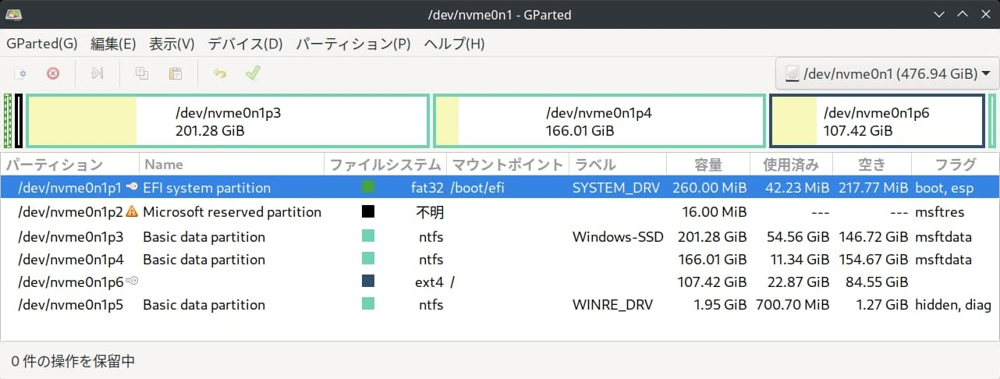

ライブ環境が起動しているという前提です。

自分のThinkBook 13s Gen3では起動する際にビープ音が鳴ったので、切るには`loader/loader.conf`の`beep on`を`beep off`に書き換えます。

起動後にもTabキーを押すたびにビープ音が鳴るので`pcspkr`をアンロードします。

```
# rmmod pcspkr
```

## 1. キーボードレイアウトの設定

```
# loadkeys jp106
```

## 2. 起動モードの確認

```
# ls /sys/firmware/efi/efivars
```
ディレクトリが存在している場合はUEFIで起動しています。
BIOSとUEFIではパーティションの切り方やブートローダーのインストール方法が異なります。

## 3. インターネット接続の確認

有線でDHCPであればそのまま接続できるはずです。

無線を使う場合は[iwctl](https://wiki.archlinux.jp/index.php/Iwd#iwctl)を使います。

```
ping archlinux.jp
```

## 4. システムクロックの更新

```
# timedatectl set-ntp true
```

## 5. パーティション

BIOSとUEFIでやり方が異なります。

今回は`/dev/sda`にインストールします。(環境によって異なります)

### BIOS

BIOSの場合は`fdisk`を使います。

### UEFI

UEFIの場合は`gdisk`を使います。

どちらとも今回は下のようなレイアウトにしました。

スワップは適宜設定してください。

|マウントポイント|パーティション|パーティションタイプ|容量|
|-|-|-|-|
|`/mnt/boot`|`/dev/sda1`|`/boot`|500MB|
|`/mnt`|`/dev/sda2`|`/`|残りすべて|

フォーマットをします。

```
# mkfs.fat -F 32 /dev/sda1
# mkfs.ext4 /dev/sda2
```

### UEFI環境でWindowsとデュアルブートする場合



画像のようなすでにあるEFIシステムパーティションがあるのでこれを使います。

**新しくEFIシステムパーティションを作らないでください**

ArchLinux用のシステムパーティションを、Windowsのパーティションの後ろに作成します。

リカバリ用のパーティションがある場合があるので(画像だと`WINRE_DRV`)、**消したり動かしたりしないでください。**

**デュアルブートは操作を誤るとWindowsのパーティションを破壊する恐れがあるので十分注意して行ってください**

## 6. ファイルシステムのマウント

```
# mount /dev/sda2 /mnt
# mkdir /mnt/boot
# mount /dev/sda1 /mnt/boot
```

### UEFI環境でWindowsとデュアルブートする場合

すでにあるEFIシステムパーティションが`/dev/sdaA`、ArchLinuxをインストールするパーティションが`/dev/sdaB`だとします。

```
# mount /dev/sdaB /mnt
# mkdir -p /mnt/boot/efi
# mount /dev/sdaA /mnt/boot/efi
```

## 7. サーバーのミラーリストの設定

次のコマンドで高速な日本のミラーを設定します。

```
# reflector --sort rate --country Japan --latest 10 --save /etc/pacman.d/mirrorlist
```

## 8. パッケージのインストール

``` 
# pacstrap /mnt base linux linux-firmware vim dhcpcd
```

今回はエディタとdhcpcdを一緒にインストールしておきます。

## 9. fstabの生成

```
# genfstab -U /mnt >> /mnt/etc/fstab
```

## 10. chroot

インストールしたディレクトリにchrootします。

```
# arch-chroot /mnt
```

## 11. タイムゾーンの設定

```
# ln -sf /usr/share/zoneinfo/Asia/Tokyo /etc/localtime
# hwclock --systohc
```

## 12. ローカリゼーション

`/etc/locale.gen`を編集して、使用するロケールをコメントアウトします。

今回は`en_US.UTF-8 UTF-8`と`ja_JP.UTF-8 UTF-8`をコメントアウトしました。

次のコマンドでロケールを生成します。

```
# locale-gen
```

`/etc/locale.conf`でLANG環境変数を設定します。

```
# echo LANG=en_US.UTF-8 > /etc/locale.conf
```

`/etc/vconsole.conf`でコンソールのキーマップも設定します。

```
# echo KEYMAP=jp106 > /etc/vconsole.conf
```

## 13. ホスト名の設定

`/etc/hostname`に好きなホスト名を設定します。

```
# echo hostname > /etc/hostname
```

`/etc/hosts`にも記述します。

```
127.0.0.1 localhost
::1       localhost
127.0.1.1 hostname.localdomain hostname
```

## 14. rootパスワードの設定

```
# passwd
```

## 15. ブートローダーのインストール

IntelCPUの場合は`pacman -S intel-ucode`、AMDCPUの場合は`pacman -S amd-ucode`でマイクロコードをインストールします。

### BIOS

```
# pacman -S grub
# grub-install --target=i386-pc --recheck /dev/sda
# grub-mkconfig -o /boot/grub/grub.cfg
```

### UEFI

```
# pacman -S grub efibootmgr
# grub-install --target=x86_64-efi --efi-directory=/boot --bootloader-id=GRUB
# grub-mkconfig -o /boot/grub/grub.cfg
```

### UEFI環境でWindowsとデュアルブートする場合

```
# pacman -S grub efibootmgr
# grub-install --target=x86_64-efi --efi-directory=/boot/efi --bootloader-id=GRUB
# grub-mkconfig -o /boot/grub/grub.cfg
```

UEFIのエントリに項目が追加されているのでそこから起動ができます。

## 16. その他

再起動後にまたビープ音が鳴ってしまうので、`pcspkr`をブラックリストに登録して、読み込まれないようにします。

```
# echo "blacklist pcspkr" > /etc/modprobe.d/nobeep.conf
```

## 17. 再起動

再起動後ネットワークに接続するために、dhcpcdサービスを有効にしておきます。

```
# systemctl enable dhcpcd
```

`exit`でchroot環境から抜けます。

`umount -R /mnt`でアンマウントし、`reboot`で再起動します。

再起動後にログインができればOKです。