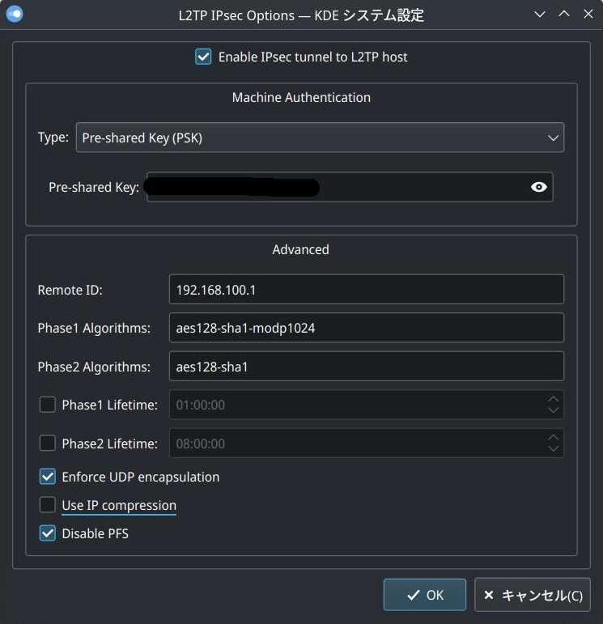

ArchLinuxでL2TP/IPSecのVPNに接続するのにかなりハマったのでメモ

接続先がYAMAHAのルーター(自分の場合はRTX1200)の場合苦労するらしい

## NetworkManagerのバージョン

最近のNetworkManagerはVPNのルーティングに問題があるようなので1.34.0にダウングレードする。

## networkmanager-l2tpとlibreswanを使う

strongswanではうまくいかないようなので、networkmanager-l2tpとlibreswanをインストールする。

libreswanはAURにあります。

`yay -S networkmanager-l2tp libreswan`

## ipsecデーモンを起動するときのエラー

`mkdir -p /var/lib/ipsec/nss`をすると起動するようにする。

## xl2tpdではなくkl2tpdを使う

xl2tpdでは`bad packet`となってしまい切断されるのでGoLang製のkl2tpdを使う。

[https://github.com/katalix/go-l2tp](https://github.com/katalix/go-l2tp)

```
$ git clone https://github.com/katalix/go-l2tp
$ cd go-l2tp/cmd/kl2tpd
$ go build
$ sudo cp kl2tpd /usr/local/sbin
```

networkmanager-l2tpはkl2tpdを優先的に使うようになっているので、`/usr/local/sbin`にコピーするだけで使える。

## IPSecの設定



`Remote ID`はサーバーVPNインターフェースのIPアドレスや`0.0.0.0`を指定しないと接続できない場合がある。

`Phase1 Algorithms`と`Phase2 Algorithms`は自分の場合はこれで接続できた。

[https://github.com/nm-l2tp/NetworkManager-l2tp/wiki/Known-Issues#querying-vpn-server-for-its-ikev1-algorithm-proposals](https://github.com/nm-l2tp/NetworkManager-l2tp/wiki/Known-Issues#querying-vpn-server-for-its-ikev1-algorithm-proposals)の方法で、VPNサーバーで使えるアルゴリズムを調べることもできる。

