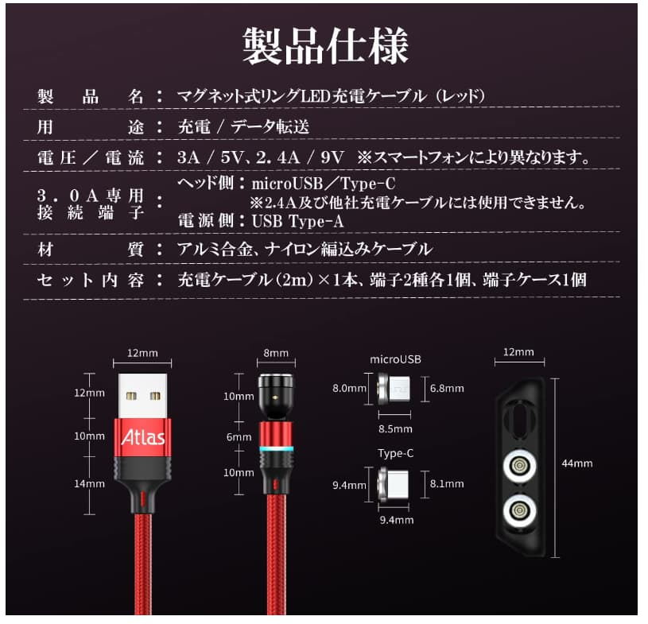

これです↓  
<https://www.amazon.co.jp/dp/B00DLK4GR4>

今回買ったのは、日本語配列のものです。  
IIのワイヤレス版と迷いましたが、値段が高いので断念。

打鍵感はとても良いです。


気になるのは、microUSBの端子部分の弱さです。  
確かに、付属のストレートケーブルだとかなりグラつきがあります。
[こちら](https://www.amazon.co.jp/dp/B0197AP7GU)のL字変換も買いましたが不安なので、[こちら](https://www.amazon.co.jp/dp/B09Q322GXV)のマグネットケーブルも買ってみました。  

実際に差し込んでみるとこんな感じ。  
見ての通り上部がかなりギリギリですが、当たってはいないので特に問題なさそうです。  
サイズが書いてある商品画像も貼っておきます。  





普通にPCに接続して使えます。


これで長持ちしそうです。  
当たり前ですが、マグネットケーブルを選ぶ際にはデータ通信対応のものを選ぶ必要があるので注意です。

自分はArch Linuxで使っていますが、カーネルにドライバが組み込まれているようなので特に問題なく使えます。  
Fn+ESCではファンクションロックを切り替えられないようですが（デフォルトでオンなのでそこまで支障はない）、下のような操作で切り替えができます。  

```bash
echo 0 | sudo tee /sys/bus/hid/devices/*17EF*/fn_lock
```
