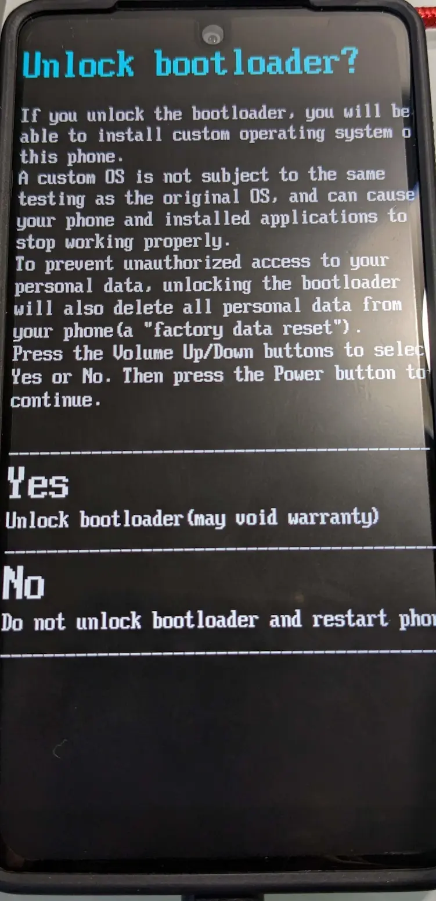
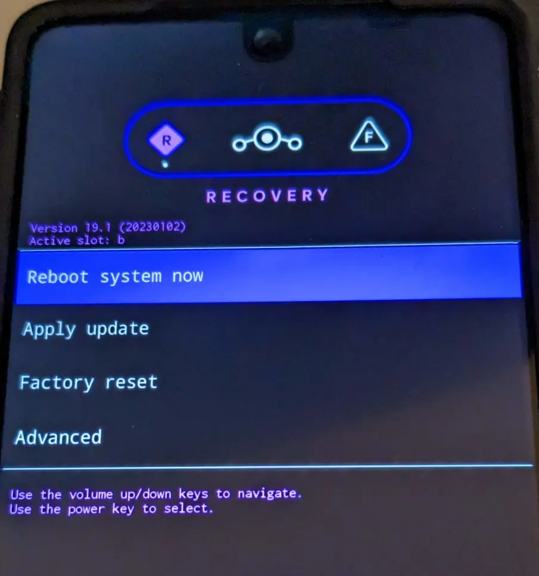

PH-1にLineageOSやGSIを焼くメモ

## 注意
自分が使っているThinkBook 13s Gen3(Ryzen 7 5800U)+Arch Linuxではfastbootの挙動がおかしくまともに使えませんでした。  
[xdaにも同じような情報](https://forum.xda-developers.com/t/fastboot-commands-not-working.3950106/)がありました。  
第3世代i3のPC(Windows10)やAtomのネットブック(Debian)では正常に動作したので、もしfastbootの動作がおかしい場合は古めのIntelPCで試してみると良いかもしれません。  
また、Linuxでは特にドライバは入れませんでした。

## ブートローダーのアンロック
**ブートローダーをアンロックすると初期化されます**

### 1. fastbootに入る
起動している状態で`adb reboot bootloader`もしくは、電源オフの状態から音量ダウン+電源でfastbootに入ります。  
`FastBoot Mode`と書いてある画面に入ればOKです。

### 2. アンロック
PCに接続し、`fastboot devices`でPH-1が認識していることを確認。  
認識していたら、`fastboot flashing unlock`を実行します。  
下のような画面が表示されるので音量ボタンでYesにを選択し、電源ボタンを押します。

{{}}

再起動がかかり、初期化されます。  
再起動後再び上と同じ手順でfastbootに入り、`fastboot flashing unlock_critical`を実行します。
同じ画面が表示されるので、ここでもYesを選択します。  
再起動がかかり初期化が終了すれば、ブートローダーのアンロックは完了です。

## LineageOSを焼く

### 1. ダウンロード
PH-1はLineageOSに公式にサポートされているので、<https://download.lineageos.org/mata>からダウンロードできます。  
ROM本体(lineage-19.1-*-nightly-mata-signed.zip)とリカバリーイメージ(lineage-19.1-*-recovery-mata.img)をダウンロードします。

### 2. リカバリーイメージを焼く
PH-1はABパーティションでリカバリーパーティションがないので、`boot`に焼きます。  
今回はTWRPではなく、LineageOSのリカバリーを使います。 
[アンロック時](#1-fastbootに入る)と同じ手順でfastbootに入ります。

fastbootに入れたら、下のコマンドでリカバリーイメージを書き込みます。
```
fastboot flash boot <リカバリーイメージのファイル>
```

### 3. リカバリーを起動
電源を切り、音量アップを押しながら電源を入れます。  
下のような画面になります。

{{}}

### 4. ROM本体を焼く
最初に`Factory Reset`→`Format data / factory reset`で初期化をします。  
`Apply update`→`Apply from ADB`に進んだら、PCに接続します。  
`adb devices`で認識していることを確認したら、下のコマンドでインストールします。
```
adb sideload <ROM本体のファイル>
```
PC側の表示が47%で止まって見えますが、正常です。

※Gappsを焼きたい場合  
Gappsは<https://wiki.lineageos.org/gapps>からダウンロードします。  
一度`Advanced`→`Reboot to Recovery`で再起動してから下のコマンドで焼きます。
```
adb sideload <Gappsのファイル>
```
`Signature verification failed`と表示されますが、`Continue`でそのまま続行します。

### 5. 起動
`Reboot system now`で起動します。

Magiskを入れたい場合は、<https://github.com/topjohnwu/Magisk/releases>からapkファイルをダウンロードします。  
一度起動した後にリカバリーに入り下のコマンドで焼きます。
```
adb sideload <Magiskのapkファイル>
```

## GSIを焼く
<https://forum.xda-developers.com/t/gsi-rom-mata-12-feb-10-android-gsi-support-for-essential-phone.4326297/>の内容です。  
今回はAndroid12のGSIを焼く場合です。

### 1. AOSPを焼く
[こちら](https://hcmuteduvn-my.sharepoint.com/:u:/g/personal/duc_nguyenquang_hcmut_edu_vn/ETeU4McKMnFJvvdrpjKDbeQBRjCdc5VZHfWrAX9IFuiUDg?e=X6rqDN)からダウンロードしたZIPファイルを解凍します。

fastbootモードに入りPCに接続したら、以下のコマンドを実行します。
```
fastboot flash boot_a boot.img
fastboot flash vendor_a vendor.img
fastboot flash system_a system.img
fastboot set_active a
fastboot -w
fastboot reboot
```
これでAOSPが起動します。

### 2. dm-verityを無効にする
AOSPが起動したらPCで以下のコマンドを実行します。
```
adb root
adb disable-verity
adb reboot bootloader
```
これでdm-verityが無効になり、fastbootに入ります。

### 3. GSIを焼く
今回は[こちら](https://github.com/phhusson/treble_experimentations/wiki/Generic-System-Image-%28GSI%29-list)からGSIを選びました。
GSIを焼いたら必ずuserdataをフォーマットします。
```
fastboot flash system_a <GSIファイル>
fastboot -w
fastboot reboot
```

Magiskをインストールしたい場合は、先ほどダウンロードしたAOSPの`boot.img`にパッチを当てて焼き直せばOKです。