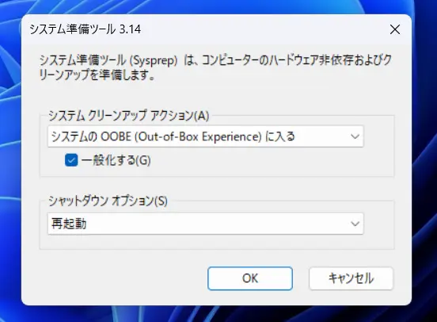

不要なアプリの削除や必要なソフトのインストール、Windows Updateの適用をしたインストールイメージ(wimファイル)を作ってみる。  
今回は環境を汚さないようにVHDにインストールしたWindowsで作業を行います。  
VHDにインストールする方法は[前の記事](/posts/20230324/windows-vhd-install/)を参照してください。

## 必要なもの
- wimファイルを保存できる十分な空き領域
- VHDにインストールしてまだ一度も起動してないWindows

## 1. Windowsを起動して監査モードに切り替える
一番最初の地域選択で日本が選ばれていることを確認したら`Ctrl + Shift + F3`を押します。  
PCが再起動し、Administratorで自動ログインしたら切り替えは完了です。

## 2. Microsoft Storeの自動更新を無効にする
**Microsoft Storeのアプリ更新が行われるとsysprepが失敗します。**

Microsoft Storeを起動し右上のアカウントボタン→アプリの設定→アプリ更新のスイッチをオフにします。

## 3. カスタマイズをする
ここでWindows Updateの適用や、アプリケーションのインストールを行います。  

自分はGoogle Chromeのインストール、時刻にUTCを使うようにしました。

### プリインストールアプリの削除
ユーザー側のみ削除すると展開時に反映されず、システム側のみ削除するとsysprepでエラーが発生するので両方削除します。
```powershell
# ユーザー側のパッケージの一覧を表示
PS C:\windows\system32> Get-AppxPackage | sort name | select name

# システム側のパッケージの一覧表示
PS C:\windows\system32> Get-AppProvisionedPackage -online | sort displayname | select displayname

# Clipchamp.Clipchampを削除する場合
PS C:\windows\system32> Get-AppxPackage "Clipchamp.Clipchamp" | Remove-AppxPackage
PS C:\windows\system32> Get-AppxProvisionedPackage -online | where displayname -like "Clipchamp.Clipchamp" | Remove-AppxProvisionedPackage -online
```

## 4. sysprepする
`Win + R`で`sysprep`を入力し、表示されたディレクトリの中の`sysprep.exe`を実行します。

{{}}

`システムのOOBEに入る`と`一般化する`にチェックが入っていることを確認しOKをクリックします。  
再起動が始まったらそのまま起動せずに、Windowsのインストールメディアから起動してください。


セットアップ画面が表示されてしまった場合は[#1-windowsを起動して監査モードに切り替える](/posts/20230324/windows-customimg/#1-windowsを起動して監査モードに切り替える)からやり直してください。

エラーで失敗する場合はMicrosoft Storeアプリが原因であることが多いので、ログを確認し`Remove-AppxPackage`で該当パッケージを削除します。

## 5. wimファイルを作成する
Windowsのインストールメディアで`Ctrl + Shift + F10`を押し、コマンドプロンプトで操作します。  
`e:\`を作業用とし、ベースのVHDが入っているとします。

```
X:\sources>mkdir e:\mount

: VHDのマウントをする
X:\sources>dism /mount-image /imagefile:"e:\windows11.vhdx" /index:1 /mountdir:"e:\mount" /readonly

: wimファイルを作成する
X:\sources>dism /capture-image /imagefile:"e:\windows11.wim" /capturedir:"e:\mount" /name:"Windows 11 Customized" /compress:max

: VHDのアンマウント
X:\sources>dism /unmount-image /mountdir:"e:\mount" /discard
```

これで`e:\windows11.wim`が作成されました。  
インストールするときは通常通り`dism /apply-image`を使います。