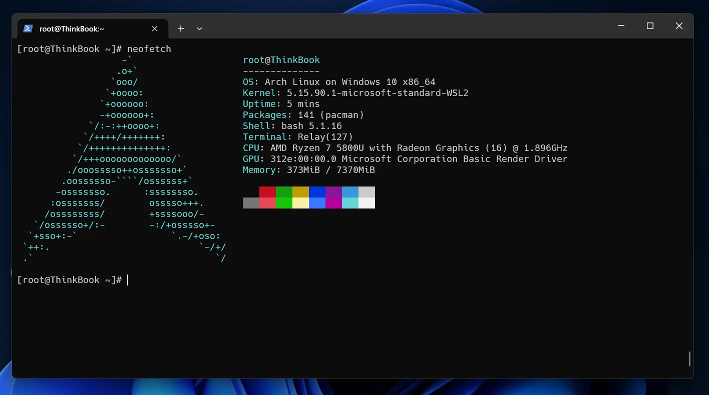

## 1. rootfsのtarballを作る
既存のArch Linux環境がある場合は`pacstrap`して`tar czvf ../rootfs.tar.gz .`で固めるだけ。  
下はAlpine Linuxで作成した例です。(WSL上でもできます)
```
minetaro12@alpine ~> cd /tmp
minetaro12@alpine /tmp> wget http://ftp.jaist.ac.jp/pub/Linux/ArchLinux/iso/latest/archlinux-bootstrap-x86_64.tar.gz
'archlinux-bootstrap-x86_64.tar.gz' saved

minetaro12@alpine /tmp> sudo tar xzvf archlinux-bootstrap-x86_64.tar.gz
minetaro12@alpine /tmp> sudo /tmp/root.x86_64/bin/arch-chroot /tmp/root.x86_64/
==> WARNING: /tmp/root.x86_64/ is not a mountpoint. This may have undesirable side effects.
[root@alpine /]# pacman-key --init
[root@alpine /]# pacman-key --populate
[root@alpine /]# curl 0sn.net/arch-mirror -L > /etc/pacman.d/mirrorlist
# ミラーリストの生成
[root@alpine /]# sed -i "s/#Server/Server/g" /etc/pacman.d/mirrorlist
[root@alpine /]# sed -i "s/CheckSpace/#CheckSpace/g" /etc/pacman.conf
[root@alpine /]# mkdir /rootfs
[root@alpine /]# pacstrap /rootfs base base-devel
[root@alpine /]# cd /rootfs
[root@alpine rootfs]# tar czvf /rootfs.tar.gz .
# 完成したrootfs.tar.gzを取り出しておく
```

## 2. tarballをWSLにインポートする
完成した`rootfs.tar.gz`をWSLにインポートします。
```
PS C:\Users\minetaro12> wsl --import archlinux C:\wsl\archlinux\ D:\rootfs.tar.gz
インポート中です。この処理には数分かかることがあります。
この操作を正しく終了しました。
PS C:\Users\minetaro12> wsl -d archlinux
[root@ThinkBook minetaro12]# cat /etc/os-release
NAME="Arch Linux"
PRETTY_NAME="Arch Linux"
ID=arch
BUILD_ID=rolling
ANSI_COLOR="38;2;23;147;209"
HOME_URL="https://archlinux.org/"
DOCUMENTATION_URL="https://wiki.archlinux.org/"
SUPPORT_URL="https://bbs.archlinux.org/"
BUG_REPORT_URL="https://bugs.archlinux.org/"
PRIVACY_POLICY_URL="https://terms.archlinux.org/docs/privacy-policy/"
LOGO=archlinux-logo
```

### systemdを使いたい場合
```
PS C:\Users\minetaro12> wsl -d archlinux
[root@ThinkBook minetaro12]# cat > /etc/wsl.conf
[boot]
systemd=true
[root@ThinkBook minetaro12]# exit
logout
PS C:\Users\minetaro12> wsl -t archlinux
この操作を正しく終了しました。
PS C:\Users\minetaro12> wsl -d archlinux
[root@ThinkBook minetaro12]# systemctl
# ユニットが表示されればOK
```

{{}}