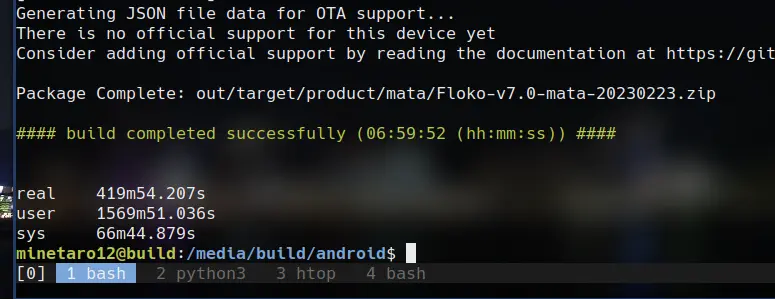

## 必要な環境
- CPU: 4コア(多いほど早くビルドが可能)
- RAM: 32GB
- SSD: 300GB以上の空き容量
- OS: Ubuntu 22.04 LTS

今回はAzureのStandard_E4as_v4(4CPU/32GB)を使用しました。

## 1. 必要なパッケージをインストール
```bash
$ sudo apt update
$ sudo apt install bc bison build-essential ccache curl flex g++-multilib gcc-multilib git git-lfs gnupg gperf imagemagick lib32ncurses5-dev lib32readline-dev lib32z1-dev libelf-dev liblz4-tool libncurses5 libncurses5-dev libsdl1.2-dev libssl-dev libxml2 libxml2-utils lzop pngcrush rsync schedtool squashfs-tools xsltproc zip zlib1g-dev libwxgtk3.0-gtk3-dev python-is-python3
```

### repoのインストール
```bash
$ mkdir -p ~/bin
$ curl https://storage.googleapis.com/git-repo-downloads/repo > ~/bin/repo
$ chmod a+x ~/bin/repo
```

`$HOME/bin`をPATHに追加する。(追加済みであれば不要)
```bash
$ cat >> .profile
if [ -d "$HOME/bin" ] ; then
    PATH="$HOME/bin:$PATH"
fi
$ source ~/.profile
```

## 2. 作業ディレクトリの作成
```bash
$ mkdir -p ~/android/lineage
```

## 3. Gitの設定
```bash
$ git config --global user.name "android"
$ git config --global user.email "android"
```

## 4. リポジトリの初期化&同期
※50GB程度のダウンロードが走るので時間がかかります
```bash
$ cd ~/android/lineage
$ repo init -u https://github.com/LineageOS/android.git -b lineage-20.0 --git-lfs
$ repo sync
```

## 5. 端末固有のソースの取得
今回は自分で作成したものを利用します。  
https://gist.github.com/minetaro12/fe54c4f4c892fff5b8e2cb59e55a7428

```bash
$ mkdir -p .repo/local_manifests

.repo/local_manifests/mata.xmlに配置する

$ repo sync
```

## 6. ビルド
```bash
$ . build/envsetup.sh
$ croot
$ brunch mata 2>&1 | tee lineage_$(date '+%Y%m%d_%H-%M-%S').log
```
ビルドが終了したら、`out/target/product/mata`の成果物を忘れずに取り出します。  
自分の環境では約7時間かかりました。
{{}}