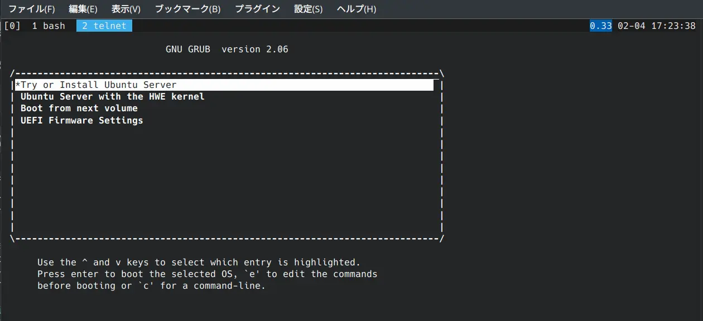

aarch64なマシンでもKVMを使って高速に仮想マシンを動かせるのでメモ。

## 事前準備
KVMを一般ユーザで使いたい場合は`kvm`グループに追加する。
```
sudo usermod -aG kvm $USER
```

## 1. 必要なパッケージのインストール
```
sudo apt install qemu-system-arm qemu-efi-aarch64 ipxe-qemu
```

## 2. UEFIの動作に必要なファイルの作成
ここで仮想マシンを格納する用のディレクトリを作成して、cdしておく。
```
dd if=/dev/zero of=flash0.img bs=1M count=64
dd if=/usr/share/qemu-efi-aarch64/QEMU_EFI.fd of=flash0.img conv=notrunc
dd if=/dev/zero of=flash1.img bs=1M count=64
```

`flash0.img`はファームウェアの格納用、`flash1.img`は書き込み用になる。

## 3. 仮想HDDの作成
`qemu-img`を使って作成してもOK
```
truncate -s 10G disk.img
```

## 4. 起動スクリプトの作成
`run.sh`のような名前で作成しておく。  
`-smp`はCPU数、`-m`はメモリの量、`-cdrom`はインストール時に使うISOファイル  
用途によって適宜変更する。

```bash
#!/bin/bash
qemu-system-aarch64 -M virt -cpu host -enable-kvm \
 -smp 2 -m 2G \
 -vnc none \
 -serial telnet:127.0.0.1:8023,server,nowait \
 -drive if=pflash,format=raw,readonly=on,file=flash0.img \
 -drive if=pflash,format=raw,file=flash1.img \
 -drive format=raw,file=disk.img \
 -cdrom hogehoge.iso
```

## 5. 起動
先ほど作成したスクリプトを実行して仮想マシンを起動させる。  
コンソールには`telnet localhost 8023`で接続することができる。

{{}}

## VNCを利用してコンソールにアクセスする
`-vnc`オプションは`:0`で5900ポート、`:1`で5901ポートのようになる。  
systemdの起動ログが流れない場合は、カーネルパラメーターに`console=tty1`を追加する。  
画面が表示されない場合は、`virtio-gpu`を`ramfb`に変更する。

```bash
#!/bin/bash
qemu-system-aarch64 -M virt -cpu host -enable-kvm \
 -smp 2 -m 2G \
 -vnc :0 \
 -drive if=pflash,format=raw,readonly=on,file=flash0.img \
 -drive if=pflash,format=raw,file=flash1.img \
 -drive format=raw,file=disk.img \
 -cdrom hogehoge.iso \
 -device virtio-gpu \
 -device qemu-xhci \
 -device usb-kbd \
 -device usb-tablet \
 -k ja
 ```

## ポートフォワーディング
ホストのTCP:8022を仮想マシンのTCP:22にバインドするには以下のようにオプションを設定する

```
-nic user,hostfwd=tcp::8022-:22
```

## NICを既存のブリッジに接続する
事前に使うブリッジを`/etc/qemu/bridge.conf`に書いておく
```
allow br0
```

`-nic`オプションを以下のようにする  
MACアドレスは省略すると固定になってしまうので、必ず指定する
```
-nic bridge,br=br0,mac="52:54:XX:XX:XX:XX"
```
