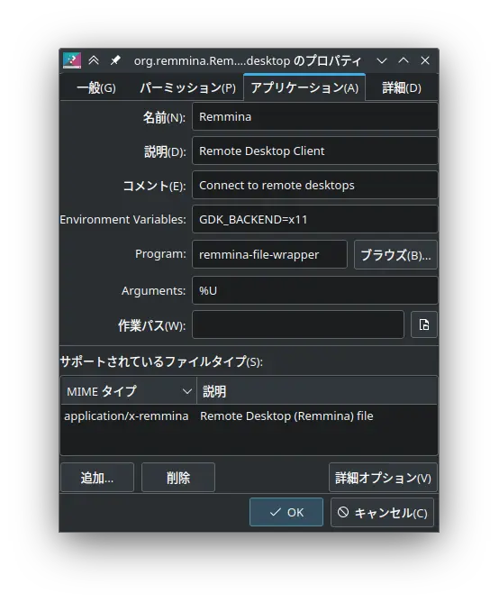

Plasma 6がリリースされてWaylandサポートがいい感じになったため、気になった点のメモ

## Waylandでうまく動かないソフトをなんとかする
- 環境変数でXwaylandを使うようにする
  - `GDK_BACKEND=x11 remmina`

下の画像はランチャーで環境変数を設定する例
{{}}


## ChromiumやElectron系ソフトで日本語入力ができない
- 仮想キーボードを使わずに、従来通りに環境変数を使ってfcitx5を設定する

`~/.config/environment.d/im.conf`に環境変数を書く
```
GTK_IM_MODULE=fcitx
QT_IM_MODULE=fcitx
XMODIFIERS=@im=fcitx
```
