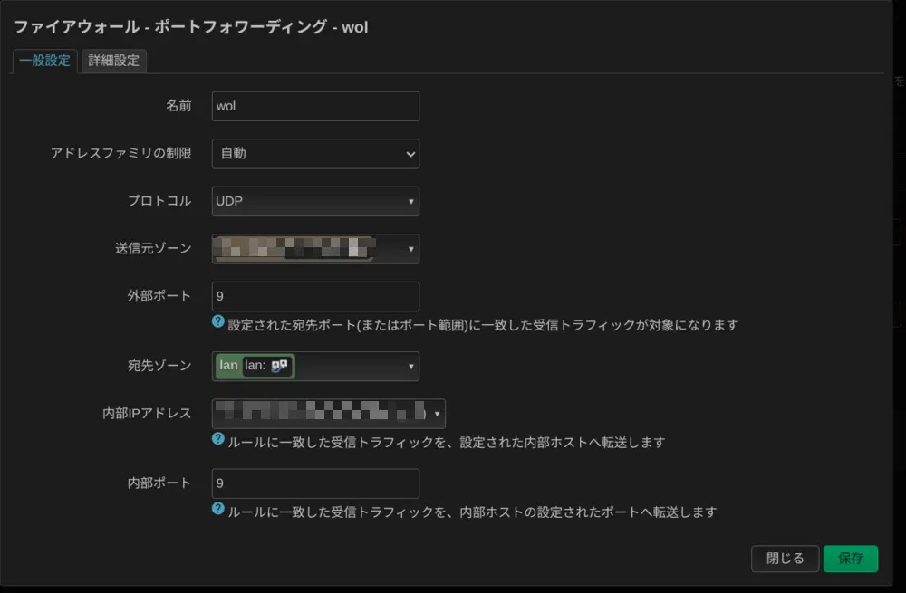

OpenWrtを使って張ってるWireGuardのセグメントからLAN内にWoLを飛ばすやり方のメモ。  
まずOpenWrtのコンソールに入り、以下のように静的ARPを設定する。
```bash
uci add network neighbor
uci set network.@neighbor[-1].interface='lan'
uci set network.@neighbor[-1].ipaddr='192.168.0.10' #WoL対象のIP
uci set network.@neighbor[-1].mac='11:11:11:11:11:11' #WoL対象のMAC
uci commit network
/etc/init.d/network restart
```

Webインターフェースのネットワーク→ファイアウォール→ポートフォワーディングで以下のように設定する。
送信元ゾーンはWireGuardのゾーン、内部IPアドレスはWoL対象の機器を設定する。
{{}}

## 実際にWoLをしてみる
WireGuard上のOpenWrtのIPアドレスのUDP9に飛ばす。
Android端末では以下のアプリが使用できることを確認できた。
- https://play.google.com/store/apps/details?id=de.florianisme.wakeonlan&hl=ja&gl=US

`wol`コマンドを使用する場合は以下のようにする。
```bash
wol 11:11:11:11:11:11 -p 9 -i <WireGuard上OpenWrtのIPアドレス>
```
