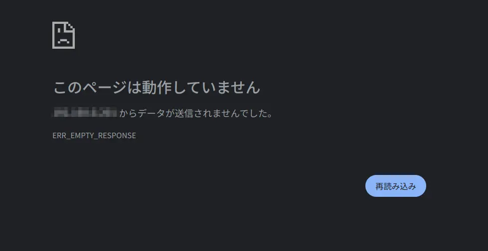

Nginxではステータスコードを444に設定すると、レスポンスを何も返さずにコネクションを切る設定がある。（`return 444;`）  
Caddyでこのような動作をさせたい場合は、`abort`と書けば同じようになる。

以下の設定は、指定したホスト名以外のアクセスは切る例。
```Caddyfile
http:// {
  abort
}

http://example.com {
  root * /var/www/html
  file_server
}
```

ブラウザから見ると画像のようになる。
{{}}
