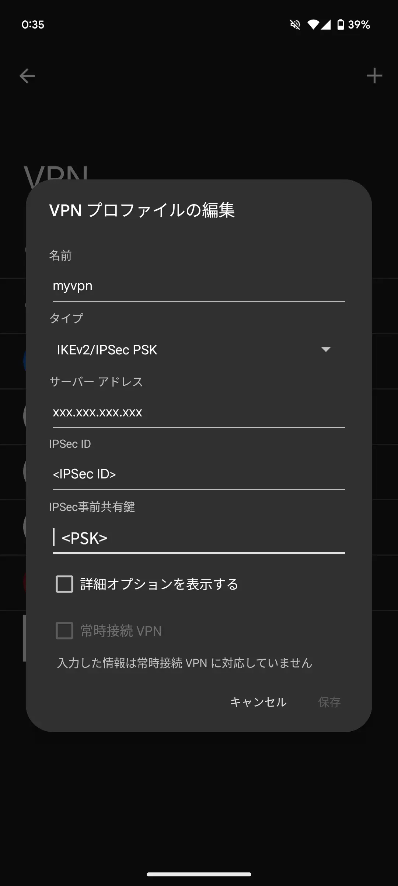

Android12以降では`L2TP/IPSec`が使えなくなったため、まだ残っている`IKEv2/IPSec PSK`で接続できるサーバーをstrongSwanで作るメモ。  
Ubuntu 24.04で検証を行った。

## 1. インストール
インストール時に自動開始するので、ここでは一旦停止する。
```bash
$ sudo apt install strongswan strongswan-swanctl
$ sudo systemctl stop ipsec
```

## 2. strongswan.confの編集
swanctlを使うため、start-scriptsを追加する。

`sudoedit /etc/strongswan.conf`
```conf
# strongswan.conf - strongSwan configuration file
#
# Refer to the strongswan.conf(5) manpage for details
#
# Configuration changes should be made in the included files

charon {
  load_modular = yes
  plugins {
    include strongswan.d/charon/*.conf
  }
  start-scripts {
    swanctl = /usr/sbin/swanctl -q
  }
}

include strongswan.d/*.conf
```

## 3. 設定ファイルの作成
この例では、クライアントに`10.1.0.0/24`のアドレスを割り当てる。  
サーバーのIPは、NATの中にある場合は**グローバルIPではなくプライベートIPを入力する。**

`sudoedit /etc/swanctl/conf.d/ikev2psk.conf`
```conf
connections {
  ikev2psk {
    version = 2
    local_addrs = <サーバーのIPかFQDN> #接続できない場合はプライベートIPや%anyを試す
    remote_addrs = %any
    pools = pool1

    local {
      auth = psk
    }

    remote {
      auth = psk
    }

    children {
      child {
        local_ts = 0.0.0.0/0 #クライアントにアクセスを許可するサブネット
      }
    }
  }
}

pools {
    pool1 {
      addrs = 10.1.0.0/24 #クライアントに割り振るIP範囲
      #dns = 1.1.1.1,1.0.0.1
    }
}

secrets {
  ike-1 {
    id = <IPSec ID>
    secret = <PSK>
  }
}
```

## 4. ufwの設定
次のコマンドでパケットの転送を許可する。
```bash
$ echo "net.ipv4.ip_forward=1" | sudo tee -a /etc/sysctl.d/99-sysctl.conf
```

次のコマンドで通信に必要なポートを許可する。
```bash
$ sudo ufw allow 500,4500/udp
```

次にクライアントがLAN内やインターネットに出られるようにNATの設定をする。  
ここでは`eth0`が物理NICだとする。
```bash
$ sudo ufw default deny routed
$ sudo ufw route allow from 10.1.0.0/24
$ sudoedit /etc/ufw/before.rules
#最下部に追加する
#NAT
*nat
-F
:POSTROUTING ACCEPT [0:0]
-A POSTROUTING -s 10.1.0.0/24 -o eth0 -j MASQUERADE
COMMIT
$ sudo ufw reload
```
環境によってはルーターのポート転送の設定も必要ですが、ここでは省略。

## 5. strongSwanの起動
```bash
$ sudo systemctl start ipsec
```

## 6. クライアントの設定
Android端末のVPN設定から、タイプを`IKEv2/IPSec PSK`にして設定を入力する。  
**IPSec IDを空にすると設定の保存ができないので注意する。**

{{}}
