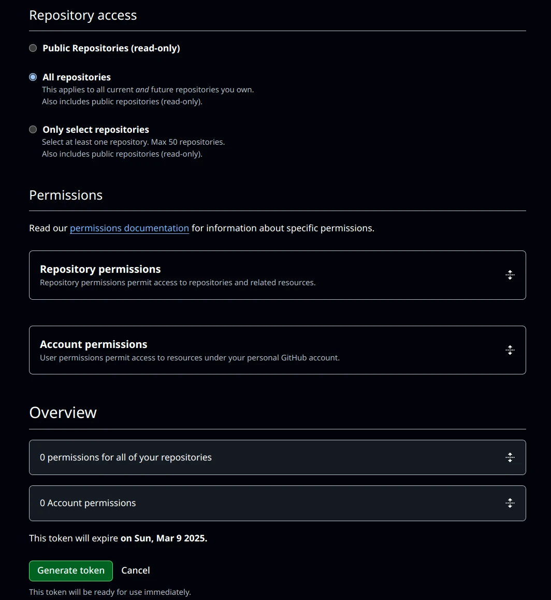

これまでのアクセストークンでは権限設定が荒かったが、`Fine-grained personal access token`を使うと読み取り・書き込みの制御も可能になります。  
ここでは、プライベートリポジトリの読み取りのみをできるアクセストークンの作成を試してみます。

## アクセストークンの作成
https://github.com/settings/personal-access-tokens  
上のリンクもしくは、GitHubのSettings→Developer settings→Personal access tokens→Fine-grained Tokensに進みます。


上の画面になったら、`Generate new token`をクリックします。

---


こちらの画面では、名前、オーナー、有効期限、トークンの説明の入力をします。  
有効期限は7日、30日、60日、90日、カスタム、無制限の中から選べます。（カスタムでは最長で１年先まで設定できるようです。）

---


下半分の画面ではアクセスを許可するリポジトリの選択、権限の設定を行います。  
プライベートリポジトリを含むすべてのリポジトリへのアクセスを許可する場合は`All repositories`、特定のリポジトリに限定したい場合は`Only select repositories`を選択します。

`Permissions`でかなり詳しく権限の設定をできますが内容が多いのでここでは省略します。（[公式ドキュメント](https://docs.github.com/ja/rest/authentication/permissions-required-for-fine-grained-personal-access-tokens)）

---
今回はすべてのリポジトリの読み取り権限のみを与えたいため`All repositories`と、`Repository permissions`の`Contents`を`Read-only`に設定します。


作成したらトークンが表示されますが、１回しか表示されないため必ずコピーしておきます。

## アクセストークンを使ってみる
試しに、作成したトークンを使ってプライベートリポジトリをクローンしてみます。
```bash
$ git clone https://github.com/<Username>/<PrivateRepo>.git
Cloning into '<PrivateRepo>'...
Username for 'https://github.com': <ユーザー名を入力>
Password for 'https://<Username>@github.com': <アクセストークンを貼り付け>
remote: Enumerating objects: 134, done.
remote: Counting objects: 100% (134/134), done.
remote: Compressing objects: 100% (62/62), done.
remote: Total 134 (delta 55), reused 134 (delta 55), pack-reused 0 (from 0)
Receiving objects: 100% (134/134), 6.30 MiB | 10.81 MiB/s, done.
Resolving deltas: 100% (55/55), done.
```
アクセストークンを使ってクローンすることができました。

```bash
$ echo hogehoge > testfile
$ git add testfile 
$ git commit -m "add testfile"
[master 5fe5056] add testfile
 1 file changed, 1 insertion(+)
 create mode 100644 testfile
$ git push
Username for 'https://github.com': <ユーザー名を入力>
Password for 'https://<Username>@github.com': <アクセストークンを貼り付け>
remote: Write access to repository not granted.
fatal: unable to access 'https://github.com/<Username>/<PrivateRepo>.git/': The requested URL returned error: 403
```
プッシュしようとするとエラーになるため、読み取り専用のアクセストークンになっていることがわかります。
