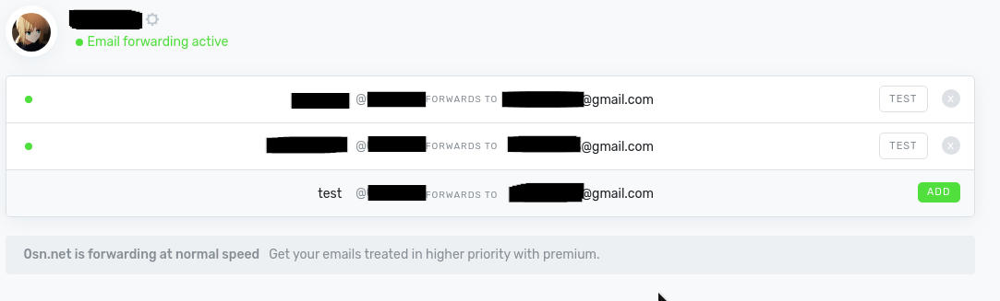
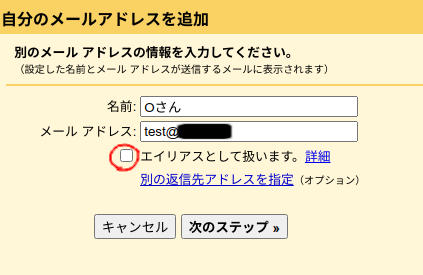
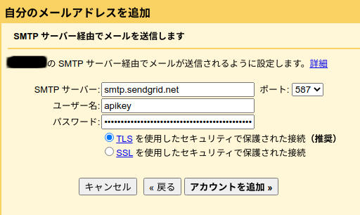
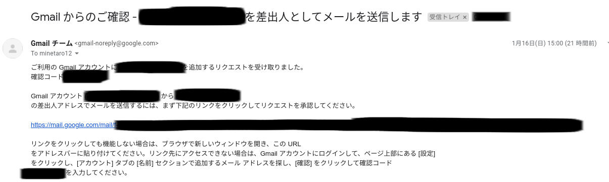
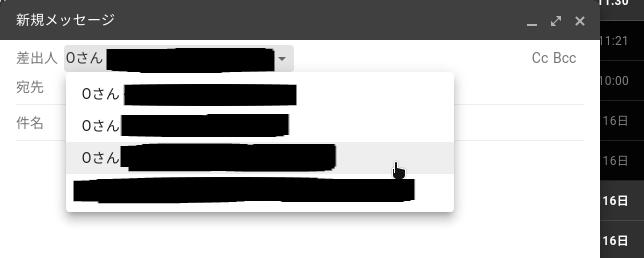
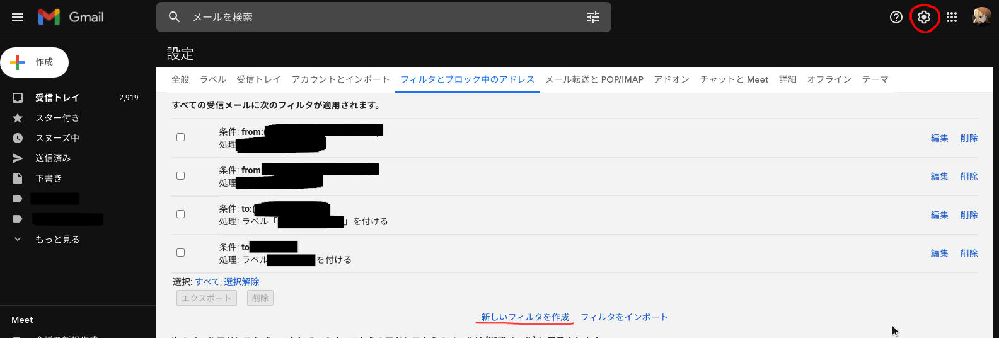
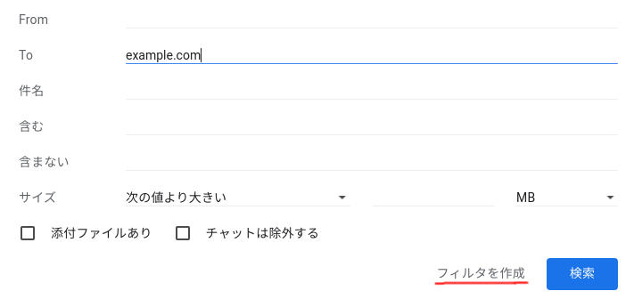
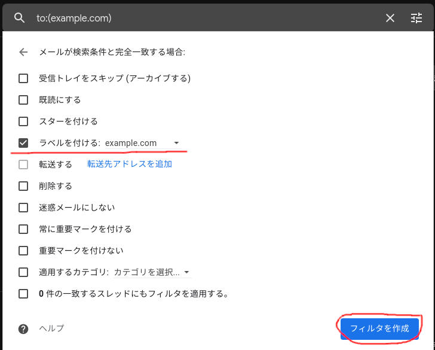
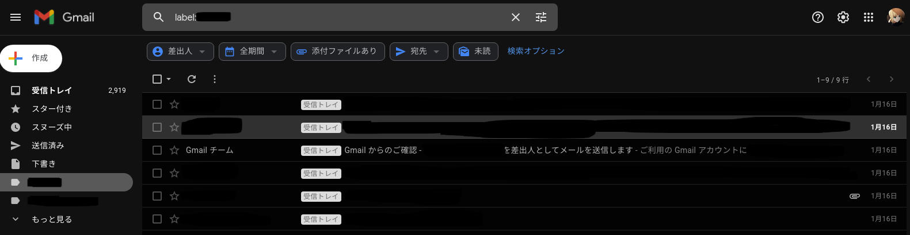

+++
title = "無料で独自ドメインメールアドレスを作ってみる"
date = "2022-01-17T11:27:16+09:00"
author = "minetaro12"
authorTwitter = "" #do not include @
cover = ""
tags = ["domain", "mail"]
keywords = ["", ""]
description = " "
showFullContent = false
readingTime = false
comments = true
toc = true
archives = ["2022", "2022-01"]
+++
自分でメールサーバーを建てずに、独自ドメインでメールを送受信してみます。

---

## 必要なもの
* 独自ドメイン(freenom等の無料ドメインでもできますが非推奨)
* [ImprovMX](https://improvmx.com/)のアカウント(CloudflareのメールルーティングでもOK)
* [SendGrid](https://sendgrid.com/)のアカウント
* Gmailアカウント

---

## 1. 受信をできるようにする

ここではImprovMXを使います。(Cloudflareのメールルーティングが使える場合はそちらでもOKです)

[こちら](https://improvmx.com/)でアカウントを作成します。

ログインできたら、`Add new domain`で独自ドメインを追加し画面の指示に従ってDNSレコードの追加をします。

DNSレコードの追加はネームサーバーによって異なるので省きます。

追加できたらエイリアスの追加をします。

FOWARDS TOの前には受信したいアドレスを入力します。(例:example@example.com)

FOWARDS TOの後には転送先のGmailアドレスを入力します。

ここで複数登録することもできます。

試しにエイリアス登録したアドレスにメールを送信し、転送先で受信できればOKです。

## 2. 送信できるようにする

ここではSendGridを使います。

[こちら](https://signup.sendgrid.com/)でアカウントを作成します。

ログインできたら、`Settings`→`Sender Authentication`→`Domain Authentication`で先程の受信できるようにしたドメインを登録します。

ここでもDNSレコードの追加があるので画面の指示に従って行います。

ドメインの登録が完了したら`Settings`→`API Keys`→`Create API Key`で、適当な名前をつけて`FullAccess`を選択し、`Create & View`をクリック。

ここでAPIキーが表示されるので<u>必ずメモ</u>します。(※後から表示はできません)

次にGmailにログインします。

右上の歯車マークを押し、`すべての設定を表示`をクリック。

`アカウントとインポート`タブに移動し、`他のメールアドレスを追加`をクリック。

`追加するメールアドレスを入力してください。`と表示されるので、先程設定したアドレスを入力します。

名前の部分は送信相手に表示されます。

`エイリアスとして扱います。`のチェックは外します。

次に、SMTPサーバーの設定をします。

SMTPサーバーは`smtp.sendgrid.net`

ユーザー名は`apikey`

パスワードは先程メモしたAPIキーを入力します。

他の部分はそのままでOKです。

アカウント追加をクリックすると、下のような確認メールが届きます。

確認メールのリンクをクリックするとアドレスの追加が完了します。

追加できていれば、メール作成画面の差出人に追加されています。

## 3. 独自ドメイン宛のメールをラベル分けする

このままでは、Gmail宛のメールと独自ドメイン宛のメールは一緒になってしまうのでラベル分けします。

Gmailの右上の歯車マークを押し、`すべての設定を表示`をクリック。

`フィルタとブロック中のアドレス`タブに移動し、`新しいフィルタを作成`をクリックします。

Toにドメインを入力して、`フィルタを作成`をクリックします。

`ラベルをつける`にチェックを入れ、 右のプルダウンメニューから`新しいラベル...`をクリックしラベルを作成します。

下の画像では`example.com`というラベルを選択しています。

できたら`フィルタを作成`をクリックします。

左側にラベルが表示されるので、独自ドメイン宛のメールはそこに表示されるようになります。

